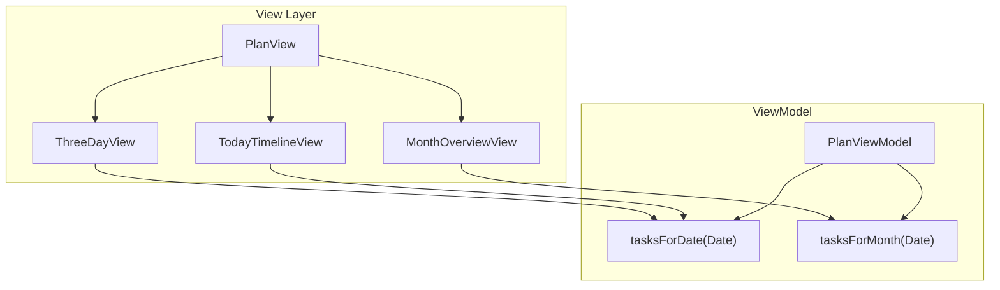

# PlanView 三视图实现计划

## 架构概览



## 当前问题分析

现有 [PlanView.swift](Rhythm/Views/Plan/PlanView.swift) 使用 `PlanViewModel.loadTasks()` 只获取带有 `windowStart` 的任务，但过滤逻辑可能导致数据为空。需要重新设计数据获取逻辑。

## 实现步骤

### 1. 更新 PlanViewModel

在 [PlanViewModel.swift](Rhythm/ViewModels/PlanViewModel.swift) 中添加:

- 更改 `PlanPeriod` 枚举为三个新模式: `today`, `nearFuture`, `monthOverview`
- 添加 `selectedDate: Date` 用于三日视图的滚动状态
- 添加 `selectedMonth: Date` 用于月视图的滚动状态
- 新增方法:
  - `tasksForDate(_ date: Date) -> [RhythmTask]` - 获取指定日期的任务
  - `tasksForMonth(_ month: Date) -> [Date: [RhythmTask]]` - 获取整月任务按日期分组
  - `loadAllTasks()` - 预加载更大范围的任务数据

### 2. 创建 TodayTimelineView

新建 `Rhythm/Views/Plan/TodayTimelineView.swift`:

- 垂直 ScrollView 显示 00:00 - 24:00 时间轴
- 每小时一行，带时间标签 (左侧)
- 任务以 block 形式显示在对应时间段
- 当前时间指示线 (红色水平线)
- 自动滚动到当前时间附近
- 利用现有 `CompactTimeBlock` 组件
```swift
// 示例结构
struct TodayTimelineView: View {
    let tasks: [RhythmTask]
    let hourHeight: CGFloat = 60
    
    var body: some View {
        ScrollViewReader { proxy in
            ScrollView {
                ZStack(alignment: .topLeading) {
                    // 时间网格背景
                    TimeGridBackground(hourHeight: hourHeight)
                    
                    // 任务块
                    ForEach(tasks) { task in
                        TaskBlock(task: task, hourHeight: hourHeight)
                    }
                    
                    // 当前时间线
                    CurrentTimeIndicator(hourHeight: hourHeight)
                }
            }
            .onAppear { scrollToCurrentTime(proxy) }
        }
    }
}
```


### 3. 创建 ThreeDayView (略有远见)

新建 `Rhythm/Views/Plan/ThreeDayView.swift`:

- 水平 ScrollView 包含多个日期列
- 固定显示 3 列 (使用 `GeometryReader` 计算宽度)
- 默认居中显示今天、明天、后天
- 可左右滑动查看过去/未来日期
- 每列顶部显示日期标题 (周几 + 日期)
- 使用 `ScrollViewReader` + `.scrollTargetLayout()` 实现精确滚动
```swift
// 示例结构
struct ThreeDayView: View {
    @Binding var centerDate: Date
    let tasksProvider: (Date) -> [RhythmTask]
    
    var body: some View {
        GeometryReader { geometry in
            let columnWidth = geometry.size.width / 3
            
            ScrollView(.horizontal, showsIndicators: false) {
                LazyHStack(spacing: 0) {
                    ForEach(dateRange, id: \.self) { date in
                        DayColumnView(
                            date: date,
                            tasks: tasksProvider(date),
                            width: columnWidth
                        )
                    }
                }
                .scrollTargetLayout()
            }
            .scrollTargetBehavior(.viewAligned)
        }
    }
}
```


### 4. 创建 MonthOverviewView (宏观布局)

新建 `Rhythm/Views/Plan/MonthOverviewView.swift`:

- 垂直 ScrollView 显示月份网格
- 7 列 (周日-周六)，每月 4-6 行
- 每个日期格子显示:
  - 日期数字
  - 任务数量指示 (小圆点或数字)
  - 可选: 任务列表缩略预览
- 上下滑动切换月份
- 今天高亮显示
- 使用 `LazyVGrid` 实现网格布局
```swift
// 示例结构  
struct MonthOverviewView: View {
    @Binding var selectedMonth: Date
    let tasksForMonth: [Date: [RhythmTask]]
    
    let columns = Array(repeating: GridItem(.flexible()), count: 7)
    
    var body: some View {
        ScrollView {
            LazyVStack(spacing: 20) {
                ForEach(monthsToShow, id: \.self) { month in
                    MonthGridView(
                        month: month,
                        tasksForDate: tasksForMonth
                    )
                }
            }
        }
    }
}

struct DayCell: View {
    let date: Date
    let tasks: [RhythmTask]
    let isToday: Bool
    
    var body: some View {
        VStack(spacing: 2) {
            Text("\(date.day)")
            if !tasks.isEmpty {
                // 任务预览点或列表
            }
        }
    }
}
```


### 5. 更新 PlanView 主视图

修改 [PlanView.swift](Rhythm/Views/Plan/PlanView.swift):

- 替换 `periodSelector` 为新的三标签选择器 (图标+文字)
- 根据选中的 period 显示对应子视图
- 保持现有的 header 和 snooze sheet 逻辑

### 6. 添加 Date 扩展

在 [Date+Extensions.swift](Rhythm/Extensions/Date+Extensions.swift) 中添加:

- `var day: Int` - 获取日期数字
- `var weekdayShort: String` - 获取短周几名称
- `var monthYearString: String` - 获取月份年份字符串
- `func daysInMonth() -> [Date]` - 获取月份所有日期
- `func adding(days: Int) -> Date` - 添加天数

### 7. 更新 Copy.swift 文案

在 [Copy.swift](Rhythm/Resources/Copy.swift) 的 `Plan` 枚举中添加:

```swift
static let todayTab = "Today"
static let nearFutureTab = "3 Days" 
static let monthTab = "Month"
static let emptySlot = "Free time"
```

## 文件变更清单

| 文件 | 操作 |

|-----|------|

| `Rhythm/ViewModels/PlanViewModel.swift` | 修改 - 添加数据方法 |

| `Rhythm/Views/Plan/PlanView.swift` | 修改 - 更新主视图结构 |

| `Rhythm/Views/Plan/TodayTimelineView.swift` | 新建 |

| `Rhythm/Views/Plan/ThreeDayView.swift` | 新建 |

| `Rhythm/Views/Plan/MonthOverviewView.swift` | 新建 |

| `Rhythm/Extensions/Date+Extensions.swift` | 修改 - 添加辅助方法 |

| `Rhythm/Resources/Copy.swift` | 修改 - 添加文案 |